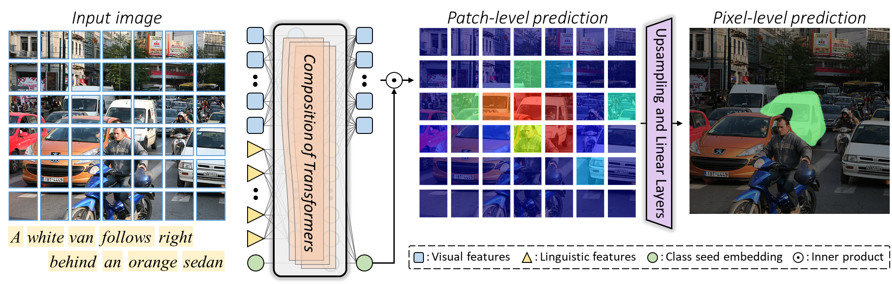

# ReSTR: Convolution-Free Referring Image Segmentation Using Transformers




> This repository contains the official source code for our paper: \
>[ReSTR: Convolution-Free Referring Image Segmentation Using Transformers](https://arxiv.org/abs/2203.16768) \
> [Namyup Kim<sup>1</sup>](https://southflame.github.io/),
> [Dongwon Kim<sup>1</sup>](https://kdwonn.github.io/),
> [Cuiling Lan<sup>2</sup>](https://scholar.google.com/citations?user=XZugqiwAAAAJ&hl=en),
> [Wenjun Zeng<sup>2</sup>](https://scholar.google.com/citations?user=_cUfvYQAAAAJ&hl=ko), and
> [Suha Kwak<sup>1</sup>](https://suhakwak.github.io/) <br>
> <sup>1</sup>POSTECH CSE, <sup>2</sup>Microsoft Research Asia<br>
> CVPR, 2022.

## Environment setup

* Python 3.7.13
* PyTorch 1.13.1+cu117

Instructions:
```shell
conda env create -f restr.yaml
conda activate restr
```

## Data Setup
### 1. Setting
- [Download](https://cocodataset.org/#download) or use symlink, such that the MS COCO images are under `data/coco/images/train2014/`
- [Download](http://www.eecs.berkeley.edu/~ronghang/projects/cvpr16_text_obj_retrieval/referitdata.tar.gz) or use symlink, such that the ReferItGame data are under `data/referit/images` and `data/referit/mask`
<!-- - Run `mkdir external`. Download, git clone, or use symlink, such that [TF-resnet](https://github.com/chenxi116/TF-resnet) and [TF-deeplab](https://github.com/chenxi116/TF-deeplab) are under `external`. Then strictly follow the `Example Usage` section of their README -->
- Download, git clone, or use symlink, such that [refer](https://github.com/chenxi116/refer) is under `external`. Then strictly follow the `Setup` and `Download` section of its README. Also, put the `refer` folder in PYTHONPATH as `export PYTHONPATH=${PYTHONPATH}:/my/restr/path/external/refer`
- Download, git clone, or use symlink, such that the [MS COCO API](https://github.com/pdollar/coco) is under `external` (i.e. `external/coco/PythonAPI/pycocotools`)

### 2. Data preparation
```
python build_batches.py -d Gref -t train --img-size 480
python build_batches.py -d Gref -t val --img-size 480
python build_batches.py -d unc -t train --img-size 480
python build_batches.py -d unc -t val --img-size 480
python build_batches.py -d unc -t testA --img-size 480
python build_batches.py -d unc -t testB --img-size 480
python build_batches.py -d unc+ -t train --img-size 480
python build_batches.py -d unc+ -t val --img-size 480
python build_batches.py -d unc+ -t testA --img-size 480
python build_batches.py -d unc+ -t testB --img-size 480
python build_batches.py -d referit -t trainval --img-size 480
python build_batches.py -d referit -t test --img-size 480
```

### 3. Directory Structure After Sutup and Data Preparation

    ├─ ./data              
          ├─ mscoco   
          │   ├─ Gref_480_batch
          │   │   ├─ train_batch
          │   │   |     ├─ Gref_train_0.npz
          │   │   |     ├─ Gref_train_1.npz
          │   │   |     └─ ...
          |   |   ├─ train_image
          │   │   ├─ train_label 
          │   │   ├─ val_batch
          │   │   ├─ val_image
          │   │   └─ val_label
          │   ├─ unc_480_batch
          │   └─ unc+_480_batch
          ├─ referit
          │   └─ referit_480_batch
          │       ├─ trainval_batch
          │       └─ text_batch
          ├─ Gref_emb.npy
          ├─ referit_emb.npy
          ├─ vocabulary_Gref.txt
          └─ vocabulary_referit.txt
    
## Training 
```
python train_restr.py --data_dir ./data/mscoco/Gref_480_batch --adamW
python train_restr.py --data_dir ./data/mscoco/unc_480_batch --adamW
python train_restr.py --data_dir ./data/mscoco/unc+_480_batch --adamW
python train_restr.py --data_dir ./data/referit/referit_480_batch --set trainval --valset test --adamW
```

## Evaluation
```
cd eval
python evaluate.py --data_dir ../data/mscoco/Gref_batch --restore_refseg ../weights/test --set val --iters 25000 --input-size 480,480 --is_vis
```

## Citation
```
@inproceedings{kim2022restr,
  title={Restr: Convolution-free referring image segmentation using transformers},
  author={Kim, Namyup and Kim, Dongwon and Lan, Cuiling and Zeng, Wenjun and Kwak, Suha},
  booktitle={Proceedings of the IEEE/CVF Conference on Computer Vision and Pattern Recognition},
  pages={18145--18154},
  year={2022}
}
```

## Acknowledgement
This code is built upon the following public repositories.
* [https://github.com/chenxi116/TF-phrasecut-public](https://github.com/chenxi116/TF-phrasecut-public)
* [https://github.com/rstrudel/segmenter](https://github.com/rstrudel/segmenter)

